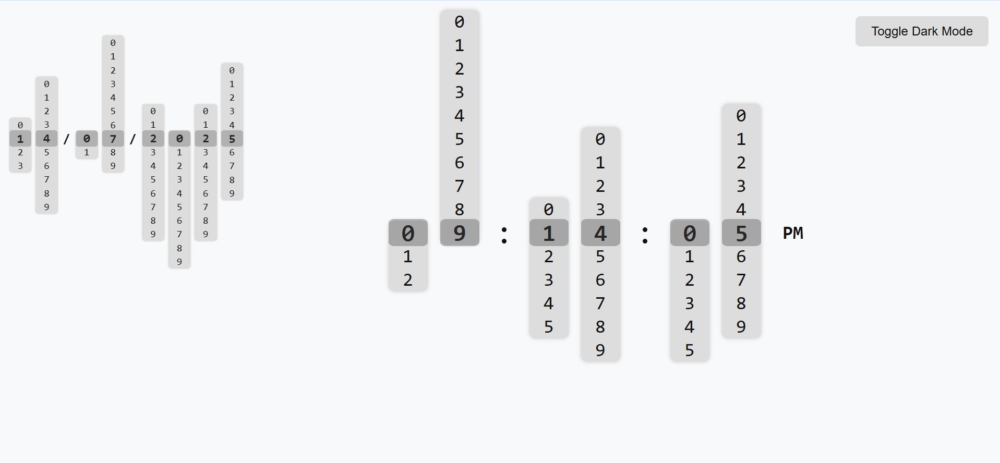
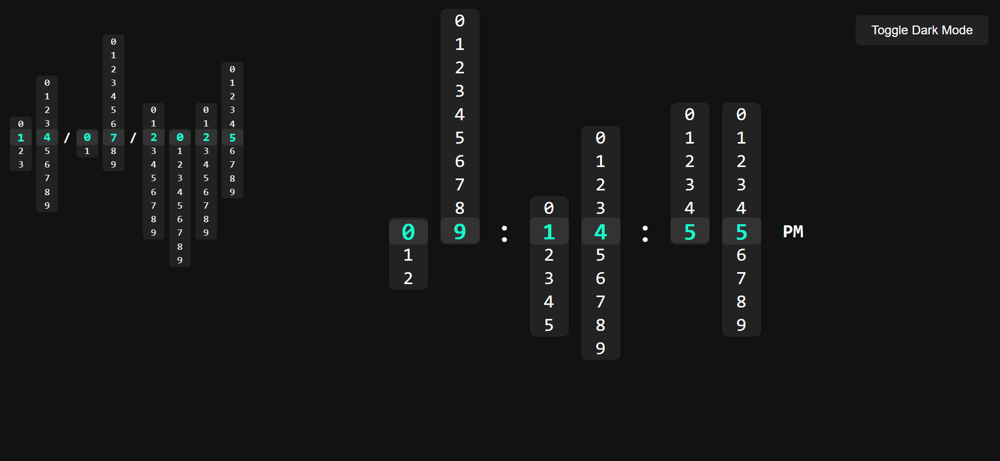

# 🕒 MV Rolling Clock Extension

A beautiful and animated **rolling digital clock and date** Chrome extension — complete with dark/light mode toggle, smooth digit transitions, and real-time sync. ✨

### Light Mode
 <!-- Optional: replace with actual screenshot -->
### Dark Mode
 <!-- Optional: replace with actual screenshot -->

---

## 🚀 Features

- 🕐 Real-time **rolling clock** animation
- 📆 Animated **rolling date** (DD/MM/YYYY)
- 🌗 Dark/Light mode toggle with persistent state
- 🔄 Auto-sync with system time (or internet time fallback)
- 🧩 Chrome extension compatible (New Tab override supported)
- ⚡ Clean, modern UI — powered by HTML, CSS, and JavaScript

---

## 📸 Preview

 <!-- Replace with a preview if available -->

---

## 🔧 How to Install (Locally)

1. **Download this repository** (or `git clone` it):

   git clone https://github.com/yourusername/mv-rolling-clock-extension.git
2. **Open Google Chrome, and go to:**
    i. chrome://extensions/

3. Enable Developer Mode using the toggle at the top right.

4. Click “Load unpacked”, and select the folder containing manifest.json.

5. Your extension is now installed! 🎉

---

## 🌍 Optional Enhancements
1. ✅ Included:
- Persistent theme toggle
- Internet time sync fallback
- New Tab override support

2. 💡 Possible future upgrades:
- World time zones
- Customizable appearance
- Hourly chime or reminder alerts

---

## 🛡 Chrome Web Store Friendly
- 🔒 No tracking
- ❌ No personal data usage
- 📦 100% offline-compatible
- ✅ Easy to use and privacy-respecting

---

## 🧠 Built With
- HTML5, CSS3
- JavaScript (ES6+)
- Chrome Extensions API
- ❤️ Passion for clean UI

---

## License © Meet Vadgama